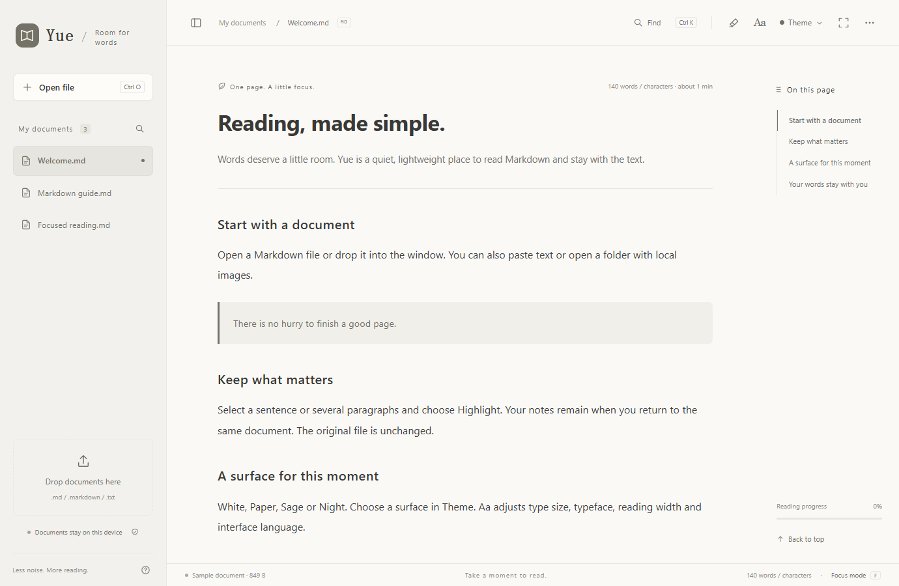

# Yue / 阅

A quiet, lightweight Markdown reader for the web and Windows.

[Website](https://yue-markdown-shiha.txqy0831.chatgpt.site/) · [Read online](https://yue-markdown-shiha.txqy0831.chatgpt.site/app/?lang=en) · [Windows download](https://github.com/shihaitian/yue-reader/releases/tag/v1.2.1) · [中文](docs/README.zh-CN.md) · [Español](docs/README.es.md) · [Français](docs/README.fr.md) · [Deutsch](docs/README.de.md) · [日本語](docs/README.ja.md) · [Português](docs/README.pt-BR.md)



Serif mode uses Georgia for Latin text, with local CJK serif fallbacks. Document headings, paragraphs, quotes and tables follow the reading font; code stays monospace. No font downloads are required.

## Read, keep, return

- Open or drop Markdown and TXT files, paste Markdown, or open a folder with local images.
- Highlight selections and paragraphs; browse, revisit, remove and undo saved highlights.
- Four muted themes: White, Paper, Sage and Night. White uses neutral grayscale surfaces.
- Seven interface languages: Simplified Chinese, English, Spanish, French, German, Japanese and Portuguese. Menus, help, examples, errors and Windows setup are translated.
- Contents, in-document search, syntax highlighting, font controls, reading position and focus mode.
- Windows file association support. The user chooses the default app in Windows Settings.

## Downloads

Version **1.2.1 is a public preview**. Get the installer, portable ZIP or self-contained offline HTML from [Releases](https://github.com/shihaitian/yue-reader/releases/tag/v1.2.1). Check the included SHA256SUMS.txt.

Windows: 10 / 11, x64, .NET Framework 4.8 and Microsoft Edge WebView2 Runtime. The runtime is **not bundled**. The installer is currently unsigned. Web: a modern browser with JavaScript and IndexedDB. Documents are limited to 5 MB and images to 15 MB.

## Data and scope

Documents and highlights are processed and stored locally. No accounts, advertising, behavioral analytics, cloud sync or automatic updates are included. The web, offline HTML and Windows app have separate stores. Clearing those stores removes saved copies and annotations. Keep your originals. External images load only after a click; they then contact the image host. Yue reads documents; it does not edit the original Markdown. [Privacy notes](docs/PRIVACY.md).

## Run and build

Use Node.js 24 or later for development. No package installation is needed to run the reader.

```sh
node md-reader/serve.mjs
# http://127.0.0.1:4173
node md-reader/build-locales.mjs --native yue-windows/src/Translations.cs
node md-reader/make-offline.mjs /absolute/path/Yue-Reader.html
node md-reader/build-site.mjs
node md-reader/serve.mjs --site
# http://127.0.0.1:4174
```

Website downloads are supplied by release assets. To include them locally, run `gh release download v1.2.1 -R shihaitian/yue-reader -D md-reader/release-assets`, then run build-site.mjs again.

Build Windows in PowerShell on Windows:

```powershell
Set-Location yue-windows
node fetch-sdk.mjs
Expand-Archive -LiteralPath vendor/webview2.zip -DestinationPath vendor/webview2 -Force
./build.ps1
```

Outputs appear in yue-windows/build. The Windows build automatically copies md-reader/dist into app/ui; keep both directories next to each other. The source archive includes the UI snapshot for standalone Windows builds. No registry changes are made by build tests.

## Verify

With the reader server running, install development dependencies in md-reader, then run `npm run check`, `npm run test:highlights` and `npm run test:localization`. Browser tests use Microsoft Edge in isolated contexts. The Windows build runs 17 native boundary/association checks. See [validation notes](docs/VALIDATION.md) for coverage and limits.

## Contribute

See [CONTRIBUTING](CONTRIBUTING.md), [security reporting](SECURITY.md), [roadmap](docs/ROADMAP.md) and [third-party notices](THIRD_PARTY_NOTICES.md). UI catalogs are seven-column UTF-8 TSV files in md-reader/locales. Run build-locales.mjs after changes; placeholders are tested. The interface system must never translate user documents.

MIT © 2026 HAITIAN SHI. Bundled dependencies retain their own licenses.
