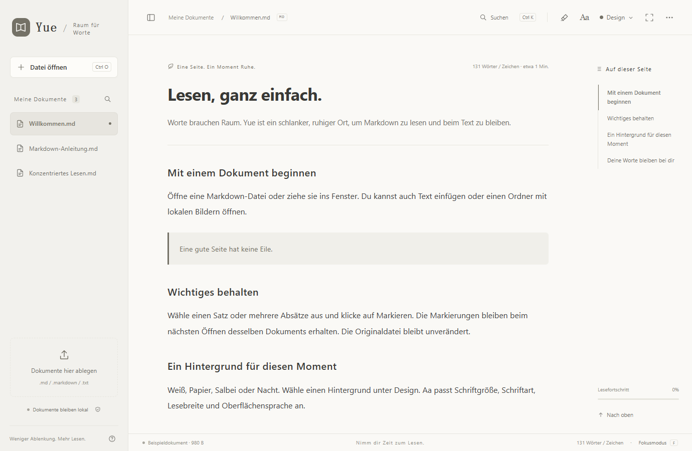

# Yue / 阅 — Deutsch

Ein schlanker, kostenloser Markdown-Reader mit lokalen Markierungen, vier dezenten Designs und sieben Sprachen. Für Web und Windows.

[Website](https://yue-markdown-shiha.txqy0831.chatgpt.site/?lang=de) · [Web-Reader öffnen](https://yue-markdown-shiha.txqy0831.chatgpt.site/app/?lang=de) · [Für Windows herunterladen](https://github.com/shihaitian/yue-reader/releases/tag/v1.2.1) · [Build / Development (English)](../README.md#run-and-build)

## Leseerlebnis

Datei ablegen, Text einfügen oder unter Windows auf .md doppelklicken. Inhaltsverzeichnis, Suche, Syntaxhervorhebung und Fokusmodus sind griffbereit.

Markiere Text oder Absätze. Lies Auszüge, springe zur Passage, entferne oder widerrufe Markierungen. Lokal gespeichert, ohne das Original zu ändern.

Dezentes Papier und Salbei, neutrales Weiß und ein ruhiges Nachtdesign.

Sieben Sprachen für Menüs, Hilfe, Beispiele und Windows-Installation. Nutze die Systemsprache oder wähle eine unter Aa.

## Windows / Web

Klicke nach der Installation auf Standard-App festlegen und wähle Yue in Windows. Oder Rechtsklick auf .md → Öffnen mit → Yue → Immer.

Windows 10 / 11 · x64 · .NET Framework 4.8 · Microsoft Edge WebView2 Runtime

Der Windows-Installer ist nicht codesigniert; Windows kann eine Herausgebermeldung anzeigen. Lade ihn hier oder über GitHub Releases herunter und prüfe SHA-256.

Keine Installation. Dateien werden lokal im Browser verarbeitet. Lade eine eigenständige HTML-Datei herunter, um offline weiterzulesen.

## Datenschutz

Der Reader verarbeitet Dokumente lokal, ohne Inhalte hochzuladen. Er enthält keine Werbung oder Verhaltensanalyse. Beim Websitebesuch erhält der Hostingdienst die üblichen Netzwerkanfragen.

Die Funktionen sind gleich, die Daten werden getrennt gespeichert. Es gibt keine Konten oder geräteübergreifende Cloud-Synchronisierung. Das Löschen der App- oder Browserdaten entfernt lokale Dokumente und Markierungen. Bewahre Originale auf.

[Problem melden](https://github.com/shihaitian/yue-reader/issues/new/choose) · [MIT License](../LICENSE)
