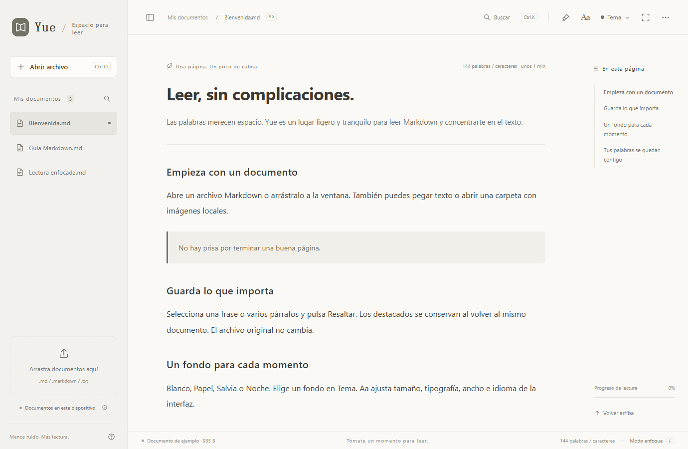

# Yue / 阅 — Español

Un lector Markdown ligero y gratuito con destacados locales, cuatro temas suaves y siete idiomas. Para web y Windows.

[Sitio web](https://yue-markdown-shiha.txqy0831.chatgpt.site/?lang=es) · [Abrir lector web](https://yue-markdown-shiha.txqy0831.chatgpt.site/app/?lang=es) · [Descargar para Windows](https://github.com/shihaitian/yue-reader/releases/tag/v1.2.2) · [Build / Development (English)](../README.md#run-and-build)

## La experiencia

Arrastra un archivo, pega texto o haz doble clic en .md en Windows. Índice, búsqueda, resaltado de código y modo enfoque a mano.

Resalta texto o párrafos. Consulta extractos, vuelve al pasaje, elimina o deshaz. Los registros se guardan localmente sin cambiar el original.

Papel y Salvia suaves, Blanco neutro y un tranquilo tema Noche.

Siete idiomas en menús, ayuda, ejemplos e instalación de Windows. Sigue el idioma del sistema o cámbialo en Aa.

## Windows / Web

Tras instalar, pulsa Definir aplicación predeterminada y elige Yue en Configuración de Windows. O clic derecho en .md → Abrir con → Yue → Siempre.

Windows 10 / 11 · x64 · .NET Framework 4.8 · Microsoft Edge WebView2 Runtime

El instalador no tiene firma de código; Windows puede mostrar un aviso del editor. Descárgalo aquí o en GitHub Releases y comprueba SHA-256.

Sin instalación. Los archivos se procesan localmente en el navegador. Descarga un HTML independiente para leer sin conexión.

## Privacidad

El lector procesa documentos en tu dispositivo sin subir su contenido. No incluye anuncios ni análisis de comportamiento. El alojamiento recibe información normal de las solicitudes al visitar el sitio.

Comparten funciones, pero guardan los registros por separado. No hay cuentas ni sincronización en la nube. Borrar los datos elimina documentos y destacados locales. Conserva los originales.

[Informar de un problema](https://github.com/shihaitian/yue-reader/issues/new/choose) · [MIT License](../LICENSE)
