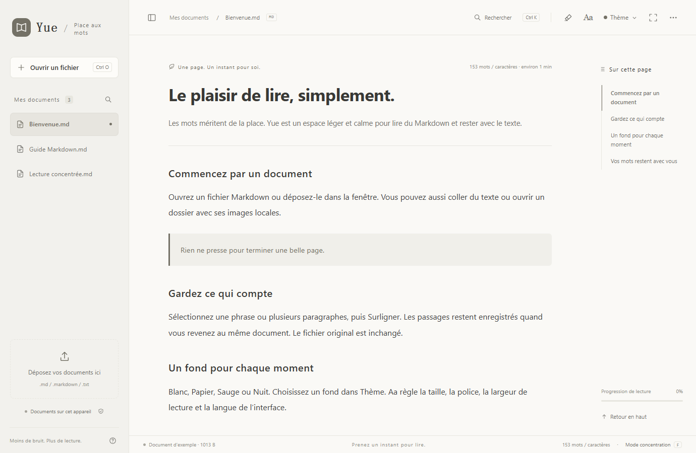

# Yue / 阅 — Français

Un lecteur Markdown léger et gratuit avec surlignages locaux, quatre thèmes discrets et sept langues. Pour le web et Windows.

[Site web](https://yue-markdown-shiha.txqy0831.chatgpt.site/?lang=fr) · [Ouvrir le lecteur web](https://yue-markdown-shiha.txqy0831.chatgpt.site/app/?lang=fr) · [Télécharger pour Windows](https://github.com/shihaitian/yue-reader/releases/tag/v1.2.1) · [Build / Development (English)](../README.md#run-and-build)

## L’expérience

Déposez un fichier, collez du texte ou double-cliquez sur .md sous Windows. Sommaire, recherche, coloration du code et mode concentration sont accessibles.

Surlignez du texte ou un paragraphe. Consultez les extraits, retrouvez le passage, supprimez ou annulez. Enregistrement local, original inchangé.

Papier et Sauge discrets, Blanc neutre et un thème Nuit apaisé.

Sept langues pour les menus, l’aide, les exemples et l’installation Windows. Suivez la langue du système ou changez-la dans Aa.

## Windows / Web

Après installation, cliquez sur Définir l’application par défaut et choisissez Yue dans Windows. Ou clic droit sur .md → Ouvrir avec → Yue → Toujours.

Windows 10 / 11 · x64 · .NET Framework 4.8 · Microsoft Edge WebView2 Runtime

L’installateur Windows n’est pas signé ; Windows peut afficher un avertissement d’éditeur. Téléchargez-le ici ou depuis GitHub Releases et vérifiez SHA-256.

Sans installation. Les fichiers sont traités localement dans le navigateur. Téléchargez le fichier HTML autonome pour lire hors ligne.

## Confidentialité

Le lecteur traite les documents sur votre appareil sans envoyer leur contenu. Il ne contient ni publicité ni analyse comportementale. L’hébergeur reçoit les informations ordinaires des requêtes lors d’une visite du site.

Les fonctions sont communes, mais les données sont stockées séparément. Il n’y a ni compte ni synchronisation cloud entre appareils. Effacer les données supprime documents et surlignages locaux. Conservez vos originaux.

[Signaler un problème](https://github.com/shihaitian/yue-reader/issues/new/choose) · [MIT License](../LICENSE)
