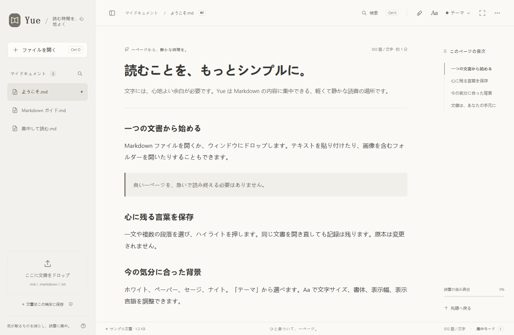

# Yue / 阅 — 日本語

ローカルハイライト、穏やかな4テーマ、7言語に対応する、軽量で無料の Markdown リーダー。Web と Windows で利用できます。

[公式サイト](https://yue-markdown-shiha.txqy0831.chatgpt.site/?lang=ja) · [Web 版を開く](https://yue-markdown-shiha.txqy0831.chatgpt.site/app/?lang=ja) · [Windows 版をダウンロード](https://github.com/shihaitian/yue-reader/releases/tag/v1.2.2) · [Build / Development (English)](../README.md#run-and-build)

## 読み心地

文書のドロップ、テキストの貼り付け、Windows の .md をダブルクリック。目次、検索、コードの色分け、集中モードも利用できます。

文字や段落を選んでハイライト。抜粋の一覧、原文への移動、解除、取り消しができます。記録は端末に保存され、原本はそのままです。

低彩度のペーパーとセージ、無彩色のホワイト、落ち着いたナイトテーマ。

メニュー、ヘルプ、サンプル、Windows のインストール手順が7言語に対応。システム言語に合わせるか、Aa から切り替えられます。

## Windows / Web

インストール後、「既定のアプリを設定」を押し、Windows の設定で Yue を選びます。または .md を右クリック → プログラムから開く → Yue → 常に使う、で設定できます。

Windows 10 / 11 · x64 · .NET Framework 4.8 · Microsoft Edge WebView2 Runtime

Windows 版はコード署名されていないため、発行元の確認が表示される場合があります。本ページまたは GitHub Releases から入手し、SHA-256 を確認してください。

インストールは不要です。ファイルはブラウザー内で処理されます。単独の HTML をダウンロードすれば、オフラインでも読めます。

## プライバシーについて

文書は端末内で処理され、内容は送信されません。広告や行動分析も導入していません。公式サイトへのアクセス時、ホスティングサービスは通常の通信情報を受け取ります。

機能は共通ですが、記録はそれぞれの環境に保存されます。アカウントやクラウド同期はありません。ブラウザーやアプリのデータを消すと文書とハイライトも削除されるため、原本は保管してください。

[問題を報告](https://github.com/shihaitian/yue-reader/issues/new/choose) · [MIT License](../LICENSE)
