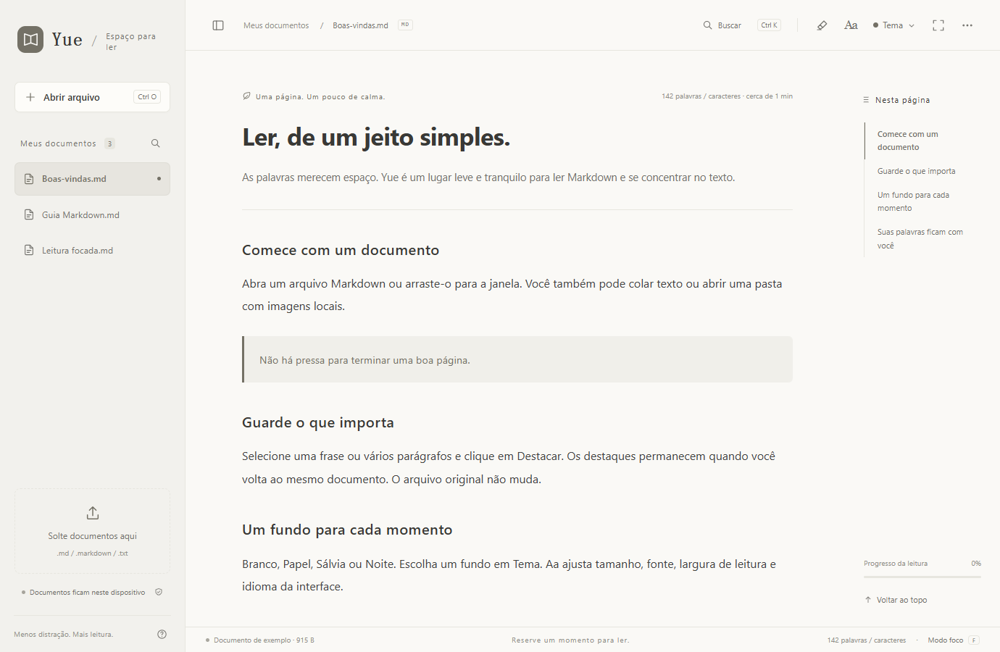

# Yue / 阅 — Português

Um leitor Markdown leve e gratuito com destaques locais, quatro temas suaves e sete idiomas. Para web e Windows.

[Site](https://yue-markdown-shiha.txqy0831.chatgpt.site/?lang=pt-BR) · [Abrir leitor web](https://yue-markdown-shiha.txqy0831.chatgpt.site/app/?lang=pt-BR) · [Baixar para Windows](https://github.com/shihaitian/yue-reader/releases/tag/v1.2.2) · [Build / Development (English)](../README.md#run-and-build)

## A experiência

Arraste um arquivo, cole texto ou dê um clique duplo em .md no Windows. Sumário, busca, realce de código e modo foco ficam à mão.

Destaque texto ou parágrafos. Veja trechos, volte à passagem, remova ou desfaça. Os registros ficam locais e o original não muda.

Papel e Sálvia suaves, Branco neutro e um tema Noite tranquilo.

Sete idiomas em menus, ajuda, exemplos e instalação do Windows. Siga o idioma do sistema ou altere em Aa.

## Windows / Web

Após instalar, clique em Definir aplicativo padrão e escolha Yue no Windows. Ou clique com o botão direito em .md → Abrir com → Yue → Sempre.

Windows 10 / 11 · x64 · .NET Framework 4.8 · Microsoft Edge WebView2 Runtime

O instalador Windows não tem assinatura de código; o sistema pode mostrar um aviso do editor. Baixe aqui ou no GitHub Releases e confira o SHA-256.

Sem instalação. Os arquivos são processados localmente no navegador. Baixe um HTML independente para ler offline.

## Privacidade

O leitor processa documentos no dispositivo, sem enviar seu conteúdo. Não tem anúncios nem análise de comportamento. A hospedagem recebe informações normais das solicitações ao visitar o site.

Os recursos são os mesmos, mas os registros são separados. Não há contas nem sincronização na nuvem. Limpar os dados do navegador ou aplicativo remove documentos e destaques locais. Guarde os originais.

[Relatar um problema](https://github.com/shihaitian/yue-reader/issues/new/choose) · [MIT License](../LICENSE)
