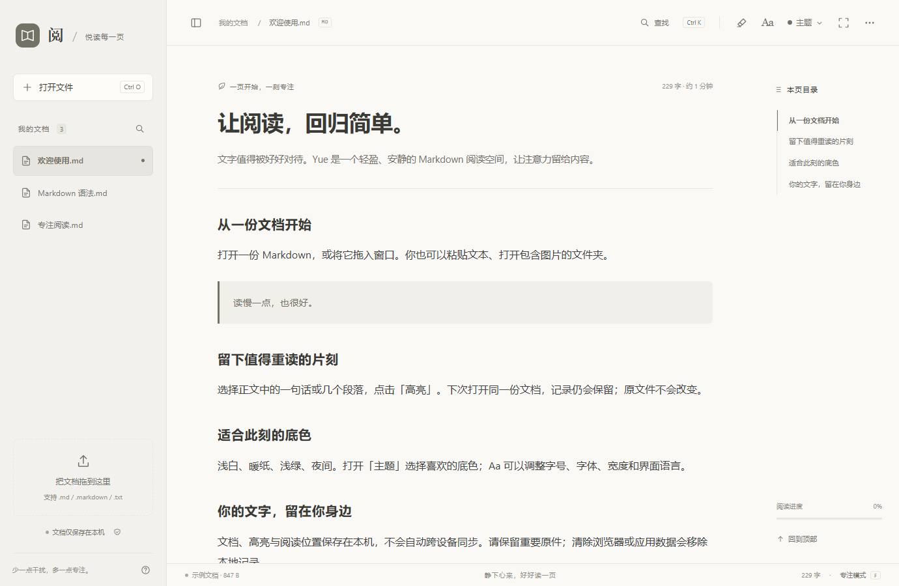

# Yue / 阅 — 简体中文

轻量、免费的 Markdown 阅读器。支持本地高亮、四种柔和主题和七种语言，提供网页版与 Windows 版。

[官网](https://yue-markdown-shiha.txqy0831.chatgpt.site/?lang=zh-CN) · [打开网页版](https://yue-markdown-shiha.txqy0831.chatgpt.site/app/?lang=zh-CN) · [下载 Windows 版](https://github.com/shihaitian/yue-reader/releases/tag/v1.2.1) · [Build / Development (English)](../README.md#run-and-build)

## 阅读体验

拖入文档、粘贴文字，或从 Windows 双击 .md。目录、文内查找、代码高亮与专注模式，随手可用。

选中文字或段落即可高亮。查看摘录、跳回原文，也能取消和撤销。记录自动保存在本地，原文件保持不变。

低饱和的暖纸和浅绿，无色相的浅白，以及安静的夜间主题。

七种语言覆盖菜单、帮助、示例与 Windows 安装流程。自动跟随系统，也可以在 Aa 中切换。

## Windows / Web

安装完成后，点击「设置默认打开方式」，在 Windows 设置中选择 Yue。也可以右键 .md → 打开方式 → 选择 Yue → 始终。

Windows 10 / 11 · x64 · .NET Framework 4.8 · Microsoft Edge WebView2 Runtime

Windows 安装包尚未代码签名，系统可能显示发布者提示。请从本页或 GitHub Releases 下载，并核对 SHA-256。

无需安装。文件在浏览器本地处理；也可以下载独立 HTML，断网继续使用。

## 隐私说明

阅读器在本机处理文档，不上传文档内容，也未接入广告或行为分析。访问官网时，托管服务仍会接收常规网络请求信息。

功能一致，但各环境分别保存本地记录，目前没有账号和跨设备云同步。清除浏览器或应用数据会移除本地文档及高亮，请保留原件。

[反馈问题](https://github.com/shihaitian/yue-reader/issues/new/choose) · [MIT License](../LICENSE)
